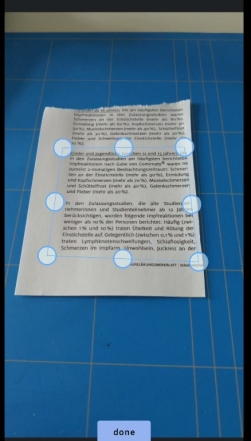

# Document scanner with cropping for Android



Android module for Appcelerator Titanium to scan and crop documents.<br/>
For iOS have a look at https://github.com/hansemannn/titanium-scanner

## Installation

```xml
<module>ti.documentscanner</module>
```

## Example:

```js
var win = Ti.UI.createWindow({});
var btn = Ti.UI.createButton({
	title: "open camera",
	bottom: 0
});
var img = Ti.UI.createImageView();
var hasImage = false;
var dsv = require("ti.documentscanner").createCropView({
	width: Ti.UI.FILL,
	height: Ti.UI.FILL,
});
win.add(dsv);
win.add(img);
win.add(btn);
btn.addEventListener("click", function() {
	if (!hasImage) {
		Ti.Media.requestCameraPermissions(function() {
			img.image = null;
			Ti.Media.showCamera({
				success: function(e) {
					dsv.image = e.media;
					hasImage = true;
					dsv.show();
					btn.title = "crop image";
				},
				error: function(e) {
					console.log("error");
				}
			})
		})
	} else {
		img.image = dsv.cropImage();
		dsv.hide();
		hasImage = false;
		btn.title = "open camera";
	}
});

win.open();
```
